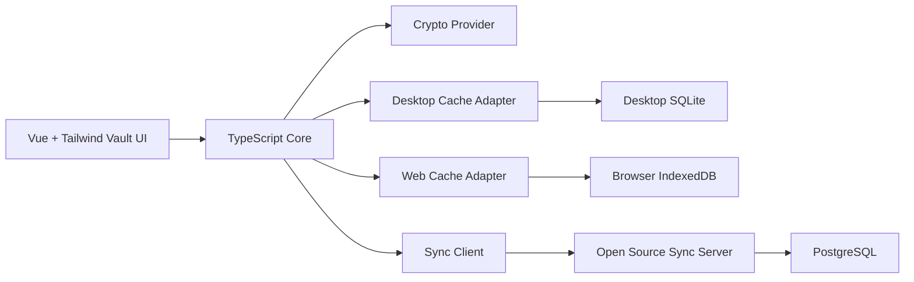

# 架构设计

## 总体方向

LockPass Next 当前采用共享客户端核心架构：Tauri 2 桌面端和普通用户 Web 端共用保险库体验与端到端加密模型，同时围绕保存协议建设开源服务器端和管理员后台基础能力。移动端、浏览器插件、多人共享保险库和完整托管商业化能力暂不进入当前阶段，但核心模型、密文格式和保存协议需要保留后续扩展能力。



## 客户端分层

| 层 | 负责 | 不负责 |
| --- | --- | --- |
| Tauri shell | 窗口、托盘、全局快捷键、系统事件、本地文件、系统 keychain | 业务规则、密文格式 |
| Vue app | 页面、交互、状态展示、表单体验 | 直接读写数据库、直接处理主密钥 |
| Core | 领域模型、业务命令、校验、锁定状态、迁移流程 | 平台 API、UI 细节 |
| Crypto | KDF、密文 envelope、AEAD 加解密、测试向量 | 用户界面、网络同步 |
| Storage adapter | SQLite 读写、事务、schema migration | 明文业务逻辑 |
| Sync client | 同步队列、revision、冲突处理、远端 API 调用 | 解密服务端数据 |

普通用户 Web 端不使用 Tauri shell。它复用 Vue 保险库 UI、Core、Crypto 和 Sync client，但平台能力通过 Web adapter 提供。浏览器本地只能保存密文缓存、cursor 和待保存队列；服务器 snapshot / pull / push 的结果是用户数据的权威来源。

Chrome 浏览器扩展也是完整的独立客户端，不依赖 Desktop。它复用 Core、Crypto、Sync client 和受信任浏览器存储模型，通过 Extension adapter 提供输入框识别、快捷填充、密码生成和登录信息保存能力。详细方案见 [Chrome 浏览器扩展设计](./browser-extension-design.md)。

## 服务器账号与首启流程

桌面端第一次启动时应引导用户登录服务器账号，可以选择 LockPass 官方托管或自建服务器。账号身份以服务器账号为准，桌面端不再维护另一套独立账号系统。

PC 客户端本机没有账号时，首屏只展示“登录”和“创建新账号”。“登录”用于已有账号恢复：用户输入邮箱、选择服务器，再输入主密码和安全密钥后拉取服务器密文并在本地解锁；“创建新账号”跳转网站，网站按邮箱验证码流程创建账号、设置主密码、生成并备份 Secret Key。

本机只保存服务器账号在当前设备上的加密缓存、解锁材料状态、设备设置和离线待保存修改。同一台设备可以切换不同服务器账号，但每个服务器账号的数据缓存、密钥材料和待保存修改必须隔离。切换账号时先锁定当前会话，再要求目标账号完成解锁。

当前阶段不做多人共享保险库。后续如果支持团队空间或共享库，可以在服务器账号下增加空间边界；服务端仍然不能拿到主密码、vault key 或明文条目。

## 服务器分层

| 层 | 负责 | 不负责 |
| --- | --- | --- |
| API | 登录态、设备认证、同步接口、配额校验 | 解密用户 vault |
| Sync service | revision 分配、增量拉取、冲突记录、tombstone 管理 | 明文合并 |
| Billing extension | 官方托管服务的套餐、设备数、存储和备份保留策略 | 自部署版本强制付费 |
| PostgreSQL | 账户、设备、密文对象、同步元数据持久化 | 保存主密码、vault key、明文字段 |

服务器端必须开源，用户可以自部署。官方可以提供托管同步服务，但托管服务不能改变协议的端到端加密属性。

## 初始仓库结构

```text
apps/
  desktop/
    src/
      app/        Vue 应用
      tauri/      Tauri 命令、插件和系统集成
  web/
    src/        普通用户 Web 保险库入口
  browser_extension/
    src/        Chrome 扩展、输入框识别、填充界面和独立保险库客户端
  server/
    src/        Rust + Axum HTTP API、同步服务、PostgreSQL migration
  admin_web/
    src/        Vue + TypeScript 管理员后台与设备绑定登录页
packages/
  core/
  crypto/
  sync/
  ui/
docs/
```

## 数据流

### 本地写入

1. 用户在 Vue UI 中创建或编辑条目。
2. UI 调用 core command。
3. core 校验数据并要求 crypto 加密敏感字段。
4. storage adapter 在 SQLite 事务中写入密文、索引元数据和本地 revision。
5. sync client 将待同步变更放入 outbox。

### 远端同步

1. 桌面端使用设备 token 调用同步服务器。
2. 客户端上传本地 outbox 中的密文变更。
3. 服务器校验账户、设备、配额和 revision，只保存密文对象。
4. 客户端拉取远端增量。
5. core 根据本地状态处理正常更新、删除标记和冲突副本。

## 本地数据库

桌面端使用 SQLite。数据库只保存密文和必要的可搜索元数据。需要支持：

1. schema version。
2. 逐步 migration。
3. 事务写入。
4. 旧版 LockPass 导入。
5. 同步 outbox 和 last synced cursor。

## 服务器数据库

服务器端使用 PostgreSQL。核心表建议包括：

1. `accounts`：账户和登录身份。
2. `devices`：设备、公钥、设备状态。
3. `sync_spaces`：服务器账号下的数据空间，第一版通常只有默认空间。
4. `wrapped_vault_keys`：协议预留的安全密钥包密文，用于后续新设备恢复闭环。
5. `sync_objects`：密文对象、revision、更新时间和删除标记。
6. `sync_events`：增量同步事件。
7. `device_sync_cursors` / `sync_idempotency_keys`：同步进度和幂等记录。
8. `instance_config`：注册、预留登录方式、配额等实例配置。

## 同步原则

1. 服务端永远不解密用户数据。
2. 所有可同步对象必须有稳定 id、版本号、更新时间和删除标记。
3. 客户端离线写入优先，联网后增量同步。
4. 冲突先保守处理：保留冲突副本，让用户确认。
5. 协议字段必须版本化，避免后续移动端或 Web 端接入时破坏兼容。

## 冲突处理策略

当前阶段采用对象级冲突副本策略。服务端只基于 revision、base revision、设备 id 和对象 id 判断是否发生并发写入，不解密、不比较、不合并密文内容。真正的冲突确认发生在客户端解锁之后。

每个可同步对象至少需要保存：

```ts
interface SyncObject {
  id: string
  vaultId: string
  revision: number
  baseRevision: number
  updatedAt: string
  updatedByDeviceId: string
  deletedAt: string | null
  encryptedPayload: string
}
```

### 对象级冲突

1. 客户端编辑条目时，记录本次修改基于的 `baseRevision`。
2. 上传到服务器时，服务器检查远端当前 `revision`。
3. 如果远端 `revision` 等于客户端 `baseRevision`，服务器接受写入并分配新 revision。
4. 如果远端 `revision` 已经变化，服务器返回冲突响应，并附带远端当前版本。
5. 客户端保留远端版本，同时把本地修改保存为冲突副本。
6. 用户解锁后在客户端查看两个版本，选择保留远端、本地副本，或手动合并后保存新版本。

冲突副本必须是普通密文对象，不能只存在内存中，避免同步中断或应用退出导致用户修改丢失。

### 删除冲突

删除使用 tombstone，不直接物理删除。当前阶段采用保守规则：

| 场景 | 处理 |
| --- | --- |
| A 删除，B 未修改 | 接受删除，写入 tombstone |
| A 删除，B 修改 | 保留 B 的修改为冲突副本，同时保留删除 tombstone |
| A 修改，B 删除 | 客户端提示远端已删除，并保留本地修改为可恢复副本 |
| A/B 同时删除 | 合并为一次删除 |

服务端可以定期清理过期 tombstone，但必须满足所有活跃设备都已经同步到删除事件，且保留时间超过最低恢复窗口。

### 后续字段级合并

字段级合并放在第二阶段。客户端解锁后可以对同一条目的两个明文版本做字段级比较，并自动合并互不冲突的字段。例如 A 设备修改 `notes`，B 设备修改 `password`，客户端可以生成合并后的新版本。

如果同一字段被多个设备同时修改，例如两个设备都修改 `password`，仍然必须让用户确认。服务端不参与字段级合并，因为服务端不能访问明文。

## 当前阶段不做

1. 移动端。
2. 浏览器插件。
3. 多人共享保险库。
4. 服务端明文搜索。
5. 完整托管商业化能力。
6. 新设备恢复闭环；`wrappedVaultKey` / `wrapped_vault_keys` 仅作为协议和数据库预留，当前不能承诺用户已可在新设备完整恢复保险库。

