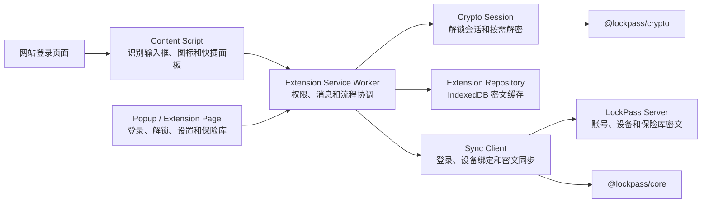

# Chrome 浏览器扩展设计

## 结论

LockPass Chrome 扩展是一个完整、独立的客户端，不依赖 Desktop，也不要求用户安装本机辅助程序。

扩展直接连接用户选择的 LockPass 官方服务器或自建服务器，负责账号登录、设备绑定、保险库密文同步、本地解锁、输入框识别、凭据填充、密码生成以及登录信息保存。服务器仍然只保存账号信息、设备信息、保险库密文和必要的同步元数据，不能获得主密码、安全密钥、`unlockKey`、`vaultKey` 或条目明文。

本方案必须遵守：

- [安全模型](./security-model.md)
- [服务器端保存方案](./server-sync-design.md)
- [网站创建账号流程](./web-account-creation-flow.md)

## 产品目标

第一版扩展需要完成以下体验：

1. 用户可以选择 LockPass 官方服务器或自建服务器。
2. 用户可以通过邮箱验证码登录已有服务器账号。
3. 新账号仍在服务器网站创建，扩展提供“创建账号”入口。
4. 新浏览器第一次使用时，用户输入主密码和安全密钥完成恢复。
5. 浏览器成为受信任浏览器后，日常解锁只输入主密码。
6. 登录页面的账号或密码输入框中显示 LockPass 图标。
7. 当前网站存在匹配记录时，用户可以一次性填充账号和密码。
8. 当前网站没有匹配记录时，可以生成密码并填入页面。
9. 用户提交登录表单后，扩展主动提示保存新登录信息。
10. 已保存账号的密码发生变化时，扩展主动提示更新。
11. 断网时仍可使用本地密文缓存；联网恢复后自动保存到服务器。
12. 中文和英文文案统一走多语言资源，组件内不得硬编码用户可见文案。

## 第一版不做

第一版暂不实现：

- 依赖 Desktop 的解锁或数据访问。
- Native Messaging。
- 无提示地保存或更新登录信息。
- Passkey 创建、保存和填充。
- 身份、地址和银行卡的整页自动填写。
- 手机验证码、短信验证码和图形验证码识别。
- 多人共享保险库。
- 页面网络请求监听或 Cookie 读取。

银行卡等条目仍可以在扩展保险库界面中查看和编辑，但第一版网页填充只处理登录条目中的账号、密码和网站地址。

## 总体架构



Desktop 和浏览器扩展是两个平级客户端：

```text
Desktop ─────────┐
Web ─────────────┼── LockPass Server
Chrome Extension ┘
```

它们通过相同的账号、设备、密文 envelope 和同步协议访问同一份保险库，但各自维护独立的设备 token、本地密文缓存和受信任设备材料。

## 模块职责

| 模块 | 负责 | 不负责 |
| --- | --- | --- |
| Content Script | 识别账号和密码输入框、挂载图标、展示页面内快捷面板、执行用户确认后的填充 | 登录服务器、保存完整保险库、持有主密码或会话密钥 |
| Popup | 展示锁定状态、快速搜索、生成密码和当前标签页匹配项 | 直接操作网页 DOM |
| Extension Page | 账号登录、首次恢复、保险库管理、设备和设置 | 向网站页面暴露敏感材料 |
| Service Worker | 消息路由、来源校验、域名匹配、同步调度、自动锁定和保存候选管理 | 长期保存明文凭据 |
| Crypto Session | Argon2id、解开 `wrappedVaultKey`、按需解密条目和管理解锁会话 | 网络请求和界面展示 |
| Extension Repository | 保存账号元数据、设备材料密文、保险库密文、cursor 和待保存队列 | 保存主密码、安全密钥明文或条目明文 |
| Sync Client | 邮箱验证码登录、设备绑定、snapshot / pull / push / ack | 解密服务器数据 |

Content Script 必须被视为靠近不可信网页的边界。它不能收到完整保险库，只能在用户明确操作后收到当前页面需要的一条凭据。

## 账号与服务器流程

### 首次打开扩展

1. 用户选择 LockPass 官方服务器或自建服务器。
2. 选择自建服务器但没有已保存地址时，必须弹出窗口要求用户输入地址，不能使用默认地址或 fallback。
3. 地址通过 HTTPS、API 版本和实例信息检查后，保存到当前账号的非敏感元数据中。
4. 用户输入邮箱并获取验证码。
5. 验证成功后，服务端为扩展注册独立设备，设备类型使用 `browser_extension`。
6. 扩展获得受限的设备 token，只允许访问当前账号的设备和密文同步 API。

扩展不把主密码作为服务器登录密码。邮箱验证码只证明服务器账号身份，不能解锁保险库。

### 创建新账号

1. 用户点击“创建账号”。
2. 扩展打开所选服务器的网站账号创建页面。
3. 用户在网站完成邮箱验证、设置主密码、生成并备份安全密钥。
4. 用户返回扩展，通过邮箱验证码登录。
5. 扩展使用主密码和安全密钥完成第一次恢复。

网站不得把主密码、安全密钥或保险库明文传给扩展。扩展必须通过用户输入或受信任浏览器存储获得解锁材料。

### 新浏览器首次恢复

1. 下载账号的 `wrappedVaultKey`、KDF 参数和保险库密文。
2. 用户输入主密码和安全密钥。
3. 扩展使用 Argon2id 派生 `unlockKey`。
4. 解开并验证 `wrappedVaultKey`，获得 `vaultKey`。
5. 只有验证成功后，扩展才生成浏览器设备密钥并加密保存安全密钥。
6. 当前浏览器成为该服务器账号的受信任浏览器。

### 日常解锁

1. 用户选择扩展中已保存的账号。
2. 用户只输入主密码。
3. 扩展使用不可导出的浏览器设备密钥解开安全密钥密文。
4. 执行完整 Argon2id，派生 `unlockKey` 并解开 `wrappedVaultKey`。
5. 解锁成功后进入保险库并启用网页填充。

浏览器重启、扩展锁定、账号切换或自动锁定后，用户需要重新输入主密码。

## 输入框识别与图标

Content Script 在获得网站权限后识别：

- `input[type="email"]`
- `input[type="password"]`
- `autocomplete="username"`
- `autocomplete="current-password"`
- `autocomplete="new-password"`
- 与登录、注册、修改密码相关的标签、名称和表单结构

动态页面和 SPA 需要通过 `MutationObserver` 处理后插入的输入框。iframe 必须按实际 frame origin 独立匹配，不能使用顶层页面域名替代 iframe 域名。

图标采用悬浮定位或输入框旁的独立容器，不修改网站原有输入框结构。快捷面板使用 Shadow DOM 隔离样式，避免被网站 CSS 破坏。

页面内快捷面板可以展示账号名称和执行填充，但不能要求用户输入主密码、安全密钥或服务器验证码。所有敏感身份验证必须在扩展 Popup 或独立扩展页面中完成，避免网站伪造 LockPass 解锁界面。

## 网站匹配规则

一个登录条目可以保存多个网站地址。匹配顺序为：

1. 完全相同的 origin，包括协议、主机名和有效端口。
2. 用户明确保存的其他网站 origin。
3. 可注册域名相同的候选项，但必须在面板中让用户选择，不能直接自动填充。

安全约束：

- `accounts.example.com` 可以匹配用户保存的同一 origin。
- `example-login.com` 不能因为标题相似而匹配 `example.com`。
- Punycode、Unicode 域名和相似字符域名必须规范化后展示真实主机名。
- HTTPS 页面默认允许填充。
- HTTP 页面默认不自动填充，用户手动选择时显示安全提示。
- 跨 origin iframe 只查询 iframe 自己的 origin。
- 页面标题、favicon 和输入框 placeholder 不能作为域名匹配依据。

## 已有记录的填充流程

```mermaid
flowchart TD
  fields["检测到账号或密码输入框"] --> icon["显示 LockPass 图标"]
  icon --> click["用户点击图标"]
  click --> locked{"扩展已解锁？"}
  locked -- "否" --> unlock["打开扩展解锁页面"]
  locked -- "是" --> match["按当前 frame origin 查询"]
  unlock --> match
  match --> count{"匹配数量"}
  count -- "0" --> empty["显示生成密码或新建登录"]
  count -- "1" --> fill["用户确认后填充账号和密码"]
  count -- "多个" --> choose["显示账号列表"]
  choose --> fill
```

第一版不在页面加载后无条件自动填充。用户点击图标或扩展 Popup 并选择账号后，扩展一次性填入账号和密码。后续可以增加用户可关闭的“可信网站自动填充”设置。

填充时只把当前选中条目的必要字段发送给对应 tab 和 frame，不能把搜索结果中的其他密码一起发送给 Content Script。

## 无记录时生成密码

当前网站没有匹配记录，或者页面包含 `autocomplete="new-password"` 时，快捷面板显示密码生成器。

第一版生成器复用 Desktop 的密码规则：

- 可设置长度。
- 可设置大小写字母和数字。
- 可控制符号数量。
- 默认至少包含 1 个符号。
- 使用密码学安全随机源。

生成后：

1. 用户点击“使用此密码”。
2. 扩展填入新密码和确认密码输入框。
3. 生成结果作为待保存候选，只存在于当前已解锁会话。
4. 用户提交注册或修改密码表单后，扩展提示保存或更新。

## 保存新登录信息

扩展可以监听表单提交、提交按钮点击、Enter 提交、页面导航和相关输入框消失，但不能仅凭其中一个事件断言登录成功。

推荐流程：

1. 用户提交账号和密码。
2. Content Script 把当前 origin、字段类型和用户输入形成的保存候选发送给 Service Worker。
3. 保存候选仅保留在当前解锁会话，不写入普通持久化存储。
4. 页面导航、表单消失或出现成功状态后，扩展显示“保存到 LockPass？”提示。
5. 用户确认后创建登录条目并立即加密。
6. 先保存到本地密文库，再尝试上传服务器。
7. 用户忽略或超时后清除候选。

扩展不能静默保存，因为页面可能正在提交一次性密码、临时密码、错误密码或测试数据。

## 更新已有密码

当账号与现有条目匹配，但提交的密码与已保存密码不同：

1. 不立即覆盖原密码。
2. 提示“更新 LockPass 中的密码？”。
3. 用户确认后创建新 revision。
4. 保留服务器历史版本，以便恢复误更新。
5. 无法确定具体账号时，要求用户选择要更新的条目。

## 密钥与本地存储

| 数据 | 保存位置 | 规则 |
| --- | --- | --- |
| 主密码 | 不保存 | 仅在解锁输入和 Argon2id 过程中短暂存在 |
| 安全密钥 | IndexedDB 中的 AES-256-GCM 密文 | 由不可导出的浏览器设备密钥加密，不保存明文 |
| 浏览器设备密钥 | 扩展 origin 的 IndexedDB | 不可导出 `CryptoKey`，每个浏览器 profile 和账号独立 |
| `unlockKey` | 不持久化 | 解开 `wrappedVaultKey` 后立即清理引用 |
| `vaultKey` | 当前扩展解锁会话 | 不写入持久化存储，不发送给 Content Script |
| `wrappedVaultKey` | IndexedDB 和服务器 | 可以持久化和同步 |
| 保险库对象 | IndexedDB 和服务器 | 只保存版本化密文 envelope |
| 设备 token | IndexedDB 中的认证密文 | 使用浏览器设备密钥加密，不能写入普通设置 |
| 主题、语言和自动锁定设置 | `chrome.storage` | 只能保存非敏感设置 |
| 同步 cursor 和 revision | IndexedDB | 非敏感同步元数据 |

Service Worker 可能被浏览器暂停，因此已解锁会话需要使用扩展受信任上下文可访问的浏览器会话内存恢复，且必须满足：

- 浏览器重启后清除。
- Content Script 不可访问。
- 扩展锁定时主动清除。
- 不保存主密码和 `unlockKey`。
- 不把会话密钥写入 `chrome.storage.local` 或 `localStorage`。

## 消息协议

所有跨模块消息必须使用带版本的判别联合类型，禁止传递无结构对象。

建议的消息类别：

```text
page.fields.detected
page.matches.query
page.credential.fill
page.password.generate
page.credential.candidate
page.credential.save
page.credential.update
extension.lock.status
extension.unlock.open
sync.status.query
```

每条消息至少绑定：

- `protocolVersion`
- tab ID
- frame ID
- origin
- request ID
- 当前账号 ID

Service Worker 必须校验消息发送者、tab、frame 和 origin。网页传入的条目 ID、URL、字段类型和保存候选都不能直接信任。

## Manifest 权限原则

第一版建议使用 Manifest V3，并把权限控制在：

```json
{
  "permissions": [
    "storage",
    "scripting",
    "alarms",
    "idle"
  ],
  "optional_host_permissions": [
    "https://*/*",
    "http://*/*"
  ]
}
```

说明：

- 要在用户打开页面时主动显示输入框图标，需要网站访问权限，只有 `activeTab` 不够。
- 优先在首次启用自动填充时请求权限，不在安装页面一次展示过多权限说明。
- 用户可以禁用某个网站，也可以只为指定网站授权。
- 不申请 `nativeMessaging`。
- 不申请 `cookies`、`webRequest` 或浏览历史权限。
- 不加载远程 JavaScript，所有运行代码必须随扩展包发布。

## 离线与同步

扩展解锁后，即使服务器离线，也可以从本地密文缓存查询和填充已有登录条目。

本地修改采用与 Desktop 相同的保存顺序：

1. 加密条目。
2. 保存到本地密文库。
3. 标记为等待保存到服务器。
4. 联网后自动 push。
5. 拉取服务器变化并处理 revision 冲突。

用户界面只显示：

- 账号离线
- 等待保存
- 已保存到服务器
- 需要处理

不向普通用户展示 cursor、revision、push 或 pull 等协议术语。

## 自动锁定

扩展需要支持：

- 浏览器启动后保持锁定。
- 指定时间无操作后自动锁定。
- 操作系统进入空闲或锁屏状态后自动锁定。
- 用户点击“锁定”立即锁定。
- 切换服务器账号前锁定当前会话。
- 扩展更新、重新加载或发生关键异常时锁定。

锁定操作必须清除 `vaultKey`、已解密条目、生成密码候选、保存候选和当前搜索结果中的敏感值。

## 页面安全边界

1. 解锁界面只能出现在扩展 Popup 或扩展页面，不能注入普通网站。
2. Content Script 不得接收安全密钥、`unlockKey`、`vaultKey` 或完整保险库。
3. 页面内面板不得显示完整密码，除非用户明确点击显示。
4. 每次填充前重新验证 tab、frame 和 origin。
5. 密码只发送到实际执行填充的 frame。
6. 页面脚本能够读取已填入页面的密码，这是网页自动填充能力无法消除的边界；因此必须严格限制域名匹配。
7. 日志、错误上报和分析事件不得包含账号、密码、网址路径、表单值或解密失败材料。
8. 剪贴板复制必须由用户操作触发，并尽可能在短时间后清理。
9. 隐身模式默认关闭，由用户明确启用；隐身数据不得与普通窗口混用。

## 项目结构

建议新增：

```text
apps/browser_extension/
  src/
    background/
      serviceWorker.ts
      messageRouter.ts
      sessionCoordinator.ts
    content/
      fieldDetector.ts
      fieldOverlay.ts
      credentialFiller.ts
      submitObserver.ts
    popup/
    pages/
      LoginPage.vue
      UnlockPage.vue
      VaultPage.vue
      SettingsPage.vue
    components/
      InlineMenu.vue
      CredentialList.vue
      PasswordGenerator.vue
      SaveCredentialPrompt.vue
    services/
      extensionRepository.ts
      browserDeviceKeyStorage.ts
      extensionSyncClient.ts
      originMatcher.ts
    locales/
      zh-CN.ts
      en-US.ts
    shared/
      messages.ts
      models.ts
  public/
    manifest.json
  tests/
  package.json
```

可以复用：

- `@lockpass/core`
- `@lockpass/crypto`
- 现有同步 DTO 和 envelope 类型
- Desktop/Web 的密码生成规则
- Desktop/Web 的保险库条目模型
- Web 的受信任浏览器安全密钥存储思路

不能直接复用包含 Tauri API、普通网页路由或页面级 `localStorage` 假设的模块，应先拆出平台无关接口，再分别提供 Web、Desktop 和 Extension adapter。

## 服务端调整

扩展优先复用现有认证和同步接口。服务端需要确认：

1. `devices` 支持 `browser_extension` 设备类型。
2. 设备名称可以显示浏览器、操作系统和扩展版本，但不保存敏感浏览历史。
3. 设备 token 权限限制在当前账号和同步空间。
4. 设备撤销后不能继续拉取或上传密文。
5. 实例配置接口能够返回公开 Web 地址、API 地址、支持的登录方式和协议版本。
6. 官方服务器和自建服务器使用相同扩展协议。

服务器不需要知道用户当前访问的网站，也不提供明文域名查询。网站匹配在扩展解锁后对本地解密数据执行。

## 测试要求

测试代码放在独立测试文件或 `tests/` 目录，不与正式代码混在一起。

### 单元测试

- origin 规范化和匹配。
- Punycode 与相似域名处理。
- 登录、注册、修改密码字段识别。
- 多网站地址条目匹配。
- 消息 schema 校验。
- 自动锁定和会话清理。
- 密码生成规则和默认符号数量。
- 安全密钥和设备 token 加密存储。
- 保存候选与更新候选状态机。

### 集成测试

- 普通 HTML 登录表单。
- Vue、React 等 SPA 动态表单。
- 多步骤登录，先账号后密码。
- 同页面多个登录表单。
- 同 origin iframe 和跨 origin iframe。
- 注册和修改密码页面。
- 多账号匹配与选择。
- 服务器离线后本地填充和待保存。
- 扩展锁定后禁止填充。

### 安全测试

- 恶意网页伪造 LockPass 面板。
- 网页发送伪造扩展消息。
- tab 导航后复用过期填充请求。
- HTTP 页面和相似域名误填充。
- 日志和异常信息泄露。
- 设备撤销后继续同步。

## 实施阶段

### 阶段 1：扩展基础与账号

- 创建 `apps/browser_extension`。
- Manifest V3、Vue、TypeScript、多语言和构建流程。
- 官方服务器与自建服务器选择。
- 邮箱验证码登录、设备绑定和退出。
- 新浏览器首次恢复与日常解锁。
- IndexedDB 密文仓库和自动锁定。

### 阶段 2：识别与填充

- 输入框识别。
- 输入框图标和 Shadow DOM 快捷面板。
- origin 匹配。
- 多账号选择。
- 一次性填充账号和密码。

### 阶段 3：生成与保存

- 密码生成器。
- 注册页面生成密码。
- 保存新登录提示。
- 更新密码提示。
- 多网站地址管理。

### 阶段 4：同步与加固

- 完整 snapshot / pull / push / ack。
- 断网待保存和冲突处理。
- iframe、SPA 和多步骤登录兼容。
- 权限管理、网站黑名单和安全审计。
- Chrome Web Store 发布和更新验证。

## 第一版验收标准

第一版完成时必须满足：

1. 未安装 Desktop 的电脑可以独立安装并使用扩展。
2. 用户可以登录官方服务器或自建服务器。
3. 新浏览器第一次输入主密码和安全密钥，之后只输入主密码。
4. 当前网站有记录时，可以从输入框图标一次性填充账号和密码。
5. 当前网站无记录时，可以生成密码，并在提交后确认保存。
6. 已保存密码变化时，可以确认更新且不会静默覆盖。
7. 断网时可以读取本地记录，修改会在联网后自动保存。
8. Content Script 无法读取完整保险库和长期密钥材料。
9. 服务器数据库中没有主密码、安全密钥、`vaultKey`、账号密码或网站地址明文。
10. 所有用户可见文案支持中文和英文。

