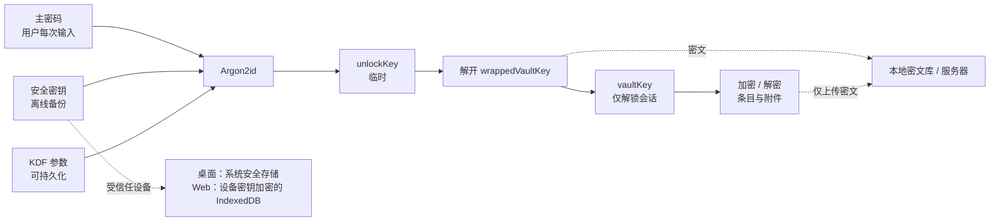
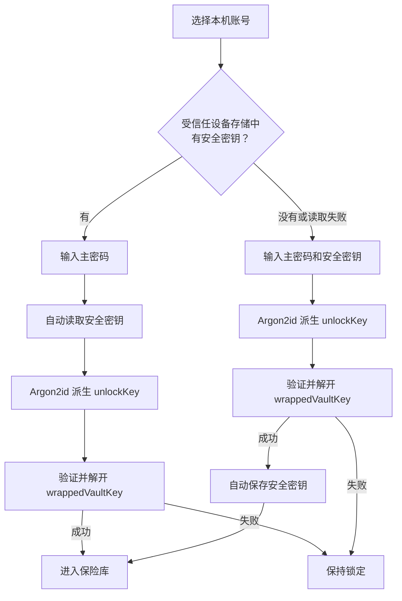

# 安全模型

本文定义 LockPass 的密钥、解锁、存储和同步安全边界。

## 核心原则

1. 主密码和密钥材料的明文只在客户端内存中短暂存在；条目明文只在已解锁会话中出现。
2. 主密码、安全密钥、`unlockKey`、`vaultKey` 和条目明文不上传服务器。
3. 服务器和普通本地存储只保存密文、版本信息和白名单内的同步元数据。
4. `unlockKey` 必须由主密码和安全密钥通过带版本参数的 Argon2id 派生。
5. `wrappedVaultKey`、条目、附件索引和备份包统一使用 AES-256-GCM 加密并认证。
6. 密文格式、KDF 参数、本地 schema、服务器 schema 和同步协议都必须带版本。
7. 桌面受信任设备把安全密钥保存到系统安全存储；受信任浏览器使用不可导出的 Web Crypto 设备密钥加密安全密钥，并把密文保存到 IndexedDB。每次解锁仍要求输入主密码并完整执行 Argon2id。
8. 默认解锁不依赖 Windows Hello、Windows PIN、指纹或人脸，也不保留免主密码解锁材料。
9. 备份包必须加密并认证，不能包含安全密钥或其他解密密钥的明文。

## 密钥模型

| 密钥 | 来源与用途 | 保存规则 |
| --- | --- | --- |
| 主密码 | 用户记忆并在解锁时输入；参与派生 `unlockKey` | 不保存、不上传 |
| 安全密钥（Secret Key，代码字段 `secretKey`） | 客户端生成的高熵随机密钥；与主密码共同派生 `unlockKey` | 用户离线备份；桌面端保存到系统安全存储；受信任浏览器只保存设备密钥加密后的密文；不上传 |
| `unlockKey` | 主密码、安全密钥和 KDF 参数通过 Argon2id 派生 | 只在一次解锁过程中短暂存在 |
| `vaultKey` | 创建保险库时由系统安全随机源生成的 32 字节随机密钥 | 只在已解锁会话内存在；持久化时必须被包裹 |
| `wrappedVaultKey` | 使用 `unlockKey` 加密后的 `vaultKey` | 可以保存到本地密文库和服务器 |

安全密钥不能找回、重置或绕过主密码。



## 受信任设备解锁

这里的“快速”不是免密码，而是用户每天只输入主密码。桌面端从系统安全存储读取安全密钥；受信任浏览器使用 IndexedDB 中的不可导出设备密钥解开安全密钥密文。两者仍在当前客户端组合后完整执行 Argon2id。

旧方案中的 `deviceUnlockKey`、`deviceWrappedVaultKey` 和 Windows Hello/PIN 解锁不再属于默认协议。现有代码或历史数据如果仍包含这些字段，只能作为待清理的兼容内容，不能为新账号继续生成。



### 首次启用或新设备恢复

1. 用户输入主密码和安全密钥。
2. 客户端使用 Argon2id 派生 `unlockKey`。
3. 客户端使用 AES-256-GCM 验证并解开 `wrappedVaultKey`，得到 `vaultKey`。
4. 只有解锁成功后，桌面端才把安全密钥保存到系统安全存储；Web 端生成不可导出的 AES-256-GCM 设备密钥，加密安全密钥后保存到 IndexedDB。
5. 客户端把当前设备或浏览器标记为受信任设备；主密码、`unlockKey` 和 `vaultKey` 始终不持久化。


### 日常解锁

1. 用户选择本机账号并输入主密码。
2. 桌面端从系统安全存储读取安全密钥；Web 端使用浏览器设备密钥解开安全密钥密文。
3. 客户端完整执行 Argon2id，派生 `unlockKey` 并解开 `wrappedVaultKey`。
4. `vaultKey` 只在保险库已解锁期间存在，用来解密条目和附件。

## 加密规则

### 密钥派生与加密

```text
passwordBytes = utf8(nfkc(主密码))
secretKeyBytes = base64url_decode(安全密钥)
unlockInput = domain("lockpass unlock v1")
              || len(passwordBytes) || passwordBytes
              || len(secretKeyBytes) || secretKeyBytes
unlockKey = Argon2id(input = unlockInput, params = kdfParams, outputLen = 32)

vaultKey = randomKey(32)
wrappedVaultKey = AES_256_GCM_Encrypt(
  key = unlockKey,
  plaintext = vaultKey,
  aad = { purpose, accountId 或 vaultId, keyId, kdfVersion, schemaVersion }
)

encryptedItem = AES_256_GCM_Encrypt(
  key = vaultKey,
  plaintext = canonicalJson(item),
  aad = { objectType, objectId, vaultId, schemaVersion, revision, keyId }
)
```

用户修改主密码时，只需使用新 `unlockKey` 重新包裹 `vaultKey`，不需要重加密全部条目。

### KDF 与 AES-256-GCM 约束

1. 主密码进入 KDF 前使用 NFKC normalization 和 UTF-8 编码。
2. 安全密钥必须由密码学安全随机源生成，展示和输入使用 base64url 或分组文本。
3. 主密码和安全密钥不能做普通字符串拼接；KDF 输入必须包含域隔离标签和长度前缀。
4. Argon2id 参数必须随 `wrappedVaultKey` 保存，并由客户端校验允许的 profile。
5. AES-256-GCM 的 AAD 必须绑定对象用途、对象 ID、保险库或账号范围、格式版本、密钥 ID 和相关 revision。
6. 解密时必须使用与加密时完全相同的 AAD，防止密文被调包到其他条目、保险库或账号。
7. 同一 `keyId` 下不能复用 nonce。随机 nonce 必须使用密码学随机源生成的 96-bit 值。
8. 禁止使用 `Math.random`、时间戳、对象 ID 或 revision 单独生成 nonce。

## 存储边界

| 位置 | 允许保存 | 禁止保存 |
| --- | --- | --- |
| 系统安全存储 | 当前账号的安全密钥 | 主密码、`unlockKey`、`vaultKey`、条目明文 |
| 受信任浏览器 IndexedDB | 不可导出的 AES-256-GCM 设备密钥、安全密钥密文、密文版本和必要绑定元数据 | 安全密钥明文、主密码、`unlockKey`、`vaultKey`、条目明文 |
| 普通 app data / SQLite | KDF 参数、`wrappedVaultKey`、密文对象、同步状态和非敏感元数据 | 安全密钥明文、主密码、会话密钥、条目明文 |
| 服务器 / PostgreSQL | `wrappedVaultKey`、密文对象、版本和白名单内的同步元数据 | 主密码、安全密钥、`unlockKey`、`vaultKey`、条目明文 |
| 解锁会话内存 | `vaultKey`、临时 `unlockKey`、当前使用的条目明文 | 任何跨锁定或跨进程重启的持久化 |
| 加密备份包 | 密文 envelope、加密 manifest、必要版本信息 | 安全密钥和其他解密密钥的明文 |

系统安全存储主要防普通本地数据库、服务器和备份文件泄露。它不能防已经控制当前 OS 用户会话的恶意软件、键盘记录器、进程注入或已解锁会话窃取。

受信任浏览器存储避免安全密钥明文进入 `localStorage`，并通过 AES-256-GCM 认证密文完整性。但不可导出 Web Crypto 密钥仍属于浏览器同源信任域，不等价于系统钥匙串或硬件安全模块。能够控制当前浏览器 Profile、当前 Origin 脚本执行环境或已解锁 OS 用户会话的攻击者，仍可能调用该设备密钥解密安全密钥。

## 安全密钥生命周期

1. 第一台设备创建保险库时生成安全密钥，并要求用户完成离线备份。
2. 完整解锁成功后，桌面端自动把安全密钥保存到当前设备的系统安全存储。
3. Web 创建账号或完整恢复成功后，当前浏览器生成不可导出的设备密钥，加密保存安全密钥，并成为受信任浏览器。
4. 已解锁的旧设备可以在用户再次输入并验证主密码后显示安全密钥或迁移二维码。
5. 二维码内容等价于安全密钥，必须短时显示，并按相同敏感级别处理。
6. 新设备使用主密码和安全密钥完成解锁后，自动保存安全密钥并成为受信任设备。
7. 安全密钥不能单独解锁保险库，也不能找回或重置主密码。
8. 如果用户丢失所有受信任设备和离线保存的安全密钥，服务器无法恢复保险库内容。
9. 用户选择从设备删除本地数据时，必须同时删除浏览器设备密钥和安全密钥密文。

当前桌面端和 Web 端都可在各自受信任存储中保存安全密钥。浏览器实现是便利性保护，不得在产品说明中宣称与系统安全存储具有相同防护强度。

## 账号与多设备流程

服务器账号用于身份验证、设备管理和密文分发，不是保险库解密凭据。网站账号创建优先使用邮箱验证码，不把主密码作为服务器长期登录密码。

| 场景 | 用户操作 | 客户端处理 |
| --- | --- | --- |
| 新用户通过 Web 首次初始化 | 网站完成邮箱验证、设置主密码并离线备份安全密钥 | 生成 `vaultKey` 和安全密钥，创建 `wrappedVaultKey`，加密保存安全密钥，上传保险库密文 |
| 老用户使用新设备或新浏览器 | 登录服务器账号；输入主密码和安全密钥 | 下载密钥包和密文，解锁成功后保存到当前平台的受信任存储 |
| 老用户使用受信任设备 | 选择本机账号；只输入主密码 | 自动读取或解开安全密钥并完成解锁 |

用户可见流程只展示“未登录服务器”“等待保存到服务器”“已保存到服务器”“有冲突”等状态，不要求用户理解同步队列、cursor、revision 或事件流。

联网时，条目修改应立即加密并保存到服务器。断网时先保存到本机密文库并标记为待保存；恢复联网、窗口回到前台或用户主动检查状态时，先上传本机修改，再拉取服务器变化。

## 客户端信任边界

1. 共享的 `@lockpass/crypto` provider 负责 Argon2id、AES-256-GCM、密文 envelope 和会话状态。
2. 页面组件只传递随机 `sessionId`，不直接持有 `vaultKey`。`sessionId` 是代码模块边界，不是操作系统级隔离。
3. Rust 负责系统安全存储、本地数据库和文件访问。Windows 解锁只读取 Credential Manager 中的安全密钥，不请求 Windows Hello/PIN。
4. Web 端和浏览器扩展分别在自己的正式用户 Runtime 中启用受信任浏览器存储；普通桌面浏览器预览不能创建浏览器设备密钥。
5. 浏览器设备密钥必须为不可导出 AES-256-GCM `CryptoKey`，安全密钥密文必须使用随机 96-bit IV，并在 AAD 中绑定用途、版本、账号 ID 和设备密钥 ID。
6. store 只保存账号 ID、`sessionId`、`keyId` 等引用状态；锁定后这些引用也必须清理。
7. 桌面 WebView 与 provider 属于同一客户端信任域。生产版只加载随安装包发布的本地资源，不加载远程 script，也不使用 `v-html`、`eval` 等动态代码执行能力；Tauri command 不作为独立于前端代码的安全隔离层。发布包和更新包仍必须签名并验证。
8. 浏览器扩展是独立客户端，不依赖 Desktop 或 Native Messaging。它必须复用 `@lockpass/crypto`、密文 envelope 和同步协议，通过扩展独立的设备密钥加密安全密钥，并且不能把完整保险库或长期密钥材料发送给 Content Script。以后如增加 Desktop 联动，Native Messaging 只能作为可选增强，不能成为扩展使用保险库的前置条件。详细边界见 [Chrome 浏览器扩展设计](./browser-extension-design.md)。

## 同步元数据边界

服务端明文元数据采用白名单。未明确列出的字段默认进入密文 envelope。

| 类别 | 服务端可明文保存 | 必须加密 |
| --- | --- | --- |
| 账号和设备 | account ID、登录凭据哈希、device ID、设备名称、设备状态、token hash、最后同步时间 | 主密码、安全密钥、`unlockKey`、`vaultKey` |
| 同步定位 | sync space ID、vault ID、object ID、object type、key ID、revision、base revision、event cursor、deletedAt、updatedAt | 保险库名称和描述、条目标题、subtitle、URL、tags、notes、字段值 |
| 附件 | attachment object ID、所属 item ID、密文大小、同步状态 | 文件名、MIME type、原始大小、明文 checksum、预览图、附件索引 |
| 搜索和统计 | 配额用量、密文对象数量、密文总大小 | 明文搜索索引、域名索引、弱密码检测结果、密码健康详情 |

如果体验要求新增服务端明文字段，必须先更新白名单，并说明泄露范围和用户可关闭方式。

## 设备撤销与回滚检测

服务端撤销设备 token 只能阻止该设备继续调用 API、拉取新密文或上传修改，不能远程清除该设备已经下载的数据或已解锁会话。

本机移除账号时，客户端必须删除该账号在系统安全存储或受信任浏览器 IndexedDB 中的安全密钥材料、设备 token、本机密文和会话状态。`vaultKey` 轮换和全量重加密属于后续增强能力；轮换后所有设备必须使用新的 `wrappedVaultKey` 完成下一次解锁。

客户端只能相对本地可信 checkpoint 检测回滚：

1. event cursor 不能小于本地已确认高水位。
2. 同一对象的 revision 不能低于本地已见最大 revision。
3. envelope AAD 中的对象 ID、保险库 ID、格式版本和 revision 必须与外层同步元数据一致。
4. 新设备首次同步没有本地 checkpoint，只能建立首次基线，或由另一台可信设备、离线备份交叉校验。

## 威胁模型

| 威胁 | 处理方式与剩余风险 |
| --- | --- |
| 本地 SQLite 泄露 | 本地数据库只保存密文和非敏感元数据 |
| 服务器或 PostgreSQL 泄露 | 服务端没有解密密钥，不能直接解密条目 |
| 服务器恶意返回旧数据 | 已使用过的设备依据本地 checkpoint 检测；新设备首次同步只能建立基线 |
| 备份文件被替换 | 备份 envelope 和 manifest 必须做完整性认证 |
| 安装包或更新包被篡改 | 发布包和更新包必须签名并验证；用户运行被篡改的客户端后，该客户端处于本机信任域内，能够接触已解锁数据 |
| 锁定后旁人操作 | 锁定销毁 provider 会话和界面明文；再次进入必须输入主密码并运行 Argon2id |
| 系统安全存储中的安全密钥泄露 | 安全密钥不能单独解锁，但攻击者仍可能结合主密码窃取或已解锁会话完成攻击 |
| 受信任浏览器 Profile 泄露或同源执行环境失陷 | 非导出设备密钥和安全密钥密文可能被一并调用；攻击者获得安全密钥后仍需主密码，但可以结合 `wrappedVaultKey` 离线猜测主密码 |
| 终端恶意软件 | Credential Manager 不等于每次读取都验证用户存在；不能抵抗键盘记录、进程注入和同用户凭据 API 滥用 |
| 日志泄露 | 禁止记录主密码、token、安全密钥、解密结果和条目明文 |

## 数据格式草案

### 密文 envelope

```json
{
  "version": 1,
  "alg": "AES-256-GCM",
  "keyId": "vault-key-id",
  "nonce": "base64url",
  "aad": {
    "objectType": "vault_item",
    "objectId": "uuid",
    "vaultId": "uuid",
    "schemaVersion": 1,
    "revision": 4,
    "purpose": "encrypt-vault-object-v1"
  },
  "ciphertext": "base64url",
  "tag": "base64url"
}
```

`wrappedVaultKey` 的 `aad.purpose` 必须是 `wrap-vault-key-v1`，并包含 `keyId`、`kdfVersion` 和 `schemaVersion`。账号级 `vaultKey` 必须绑定 `accountId`；单保险库密钥必须绑定 `vaultId`。

### KDF 参数

```json
{
  "version": 1,
  "name": "argon2id",
  "memoryKiB": 32768,
  "iterations": 2,
  "parallelism": 1,
  "salt": "base64url",
  "keyLengthBytes": 32,
  "inputEncoding": "domain-tagged-length-prefixed-utf8",
  "passwordNormalization": "NFKC",
  "purpose": "lockpass unlock v1"
}
```

当前开发阶段只接受该 profile。调整参数时开发库需要删除并重新创建账号；正式发布前必须设计参数迁移策略。

## 数据库迁移

1. 每次 schema 变更提升 `schemaVersion`。
2. migration 必须逐步执行，例如 `1 -> 2 -> 3`，不能只实现 `1 -> 3`。
3. SQLite 和 PostgreSQL migration 必须在事务中执行，失败时完整回滚。
4. 迁移测试必须覆盖旧库 fixture、旧密文格式和服务器 schema。
