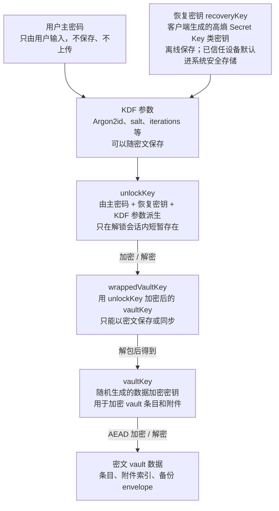

# 安全模型

## 设计原则

1. 明文只在桌面端解锁会话中短暂存在。
2. 主密码、恢复密钥（`recoveryKey`）、vault key 和可解密密钥不上传服务器。
3. 服务器端和 PostgreSQL 只能保存密文、revision、设备信息和下文白名单内的同步元数据。
4. 密钥派生必须使用带参数版本的 KDF，默认优先 Argon2id。
5. 条目加密使用 AEAD，例如 AES-256-GCM 或 XChaCha20-Poly1305。
6. 密文格式、KDF 参数、本地 schema、服务器 schema 和同步协议都必须带版本。
7. 备份包必须加密并认证，不允许把恢复密钥（`recoveryKey`）或其他辅助密钥明文打包。
8. 受信任设备的免主密码快速解锁必须使用能证明用户存在的系统认证保护本地密钥材料，例如 Windows Hello、macOS Touch ID/设备密码或等价机制；这些材料不上传服务器，也不能作为跨设备恢复手段。

## 密钥模型

建议采用分层密钥：

1. 主密码：用户记忆并在解锁时输入的密码，不明文保存、不上传服务器，也不直接加密 vault 条目。
2. `recoveryKey`：客户端生成的高熵 Secret Key 类恢复密钥，展示给用户离线保存；已信任设备默认另存到系统安全存储。
3. `unlockKey`：由主密码、`recoveryKey` 和 KDF 参数按固定编码派生。
4. `vaultKey`：随机生成的数据加密密钥，用于加密 vault 内敏感数据。
5. `wrappedVaultKey`：使用 `unlockKey` 加密后的 `vaultKey`，只以密文形式保存；服务端同步和新设备恢复相关流程当前按协议预留/待完成处理。
6. `deviceUnlockKey`：每台受信任设备本地生成的随机快速解锁密钥，必须保存在要求系统认证或用户存在性校验后才能释放的系统能力中。
7. `deviceWrappedVaultKey`：使用 `deviceUnlockKey` 加密后的 `vaultKey`，只保存在本机普通 app data 中，不同步、不上传、不作为备份恢复材料。



简化伪代码：

```text
# 恢复密钥（recoveryKey）：辅助主密码派生 unlockKey，用户需要离线保存；已信任设备默认保存在系统安全存储。
passwordBytes = utf8(nfkc(主密码))
recoveryKeyBytes = base64url_decode(recoveryKey)
unlockInput = domain("lockpass unlock v1") || len(passwordBytes) || passwordBytes || len(recoveryKeyBytes) || recoveryKeyBytes
unlockKey = Argon2id(input = unlockInput, params = kdfParams, outputLen = 32)

# vaultKey：真正加密 vault 数据的随机钥匙。
vaultKey = randomKey()

# wrappedVaultKey：vaultKey 被 unlockKey 通过 AEAD 包裹后的密文，可以保存或同步。
wrappedVaultKey = AEAD_Encrypt(
  key = unlockKey,
  plaintext = vaultKey,
  aad = { purpose: "wrap-vault-key-v1", vaultId, keyId, kdfVersion }
)
vaultKey = AEAD_Decrypt(key = unlockKey, ciphertext = wrappedVaultKey, aad = sameAAD)

# vault 数据：真正的密码条目由 vaultKey 加密。
密文条目 = AEAD_Encrypt(
  key = vaultKey,
  plaintext = canonicalJson(明文条目),
  aad = { objectType, objectId, vaultId, schemaVersion, revision, keyId }
)
明文条目 = AEAD_Decrypt(key = vaultKey, ciphertext = 密文条目, aad = sameAAD)
```

用户修改主密码时，只需要重新包裹 `vaultKey`，不需要重加密所有条目。用户导入旧版 LockPass 数据时，需要读取旧格式，再写入新版 envelope。

## KDF 和 AEAD 规则

1. 主密码进入 KDF 前必须做固定 Unicode normalization，推荐 NFKC，然后用 UTF-8 编码。
2. 恢复密钥（`recoveryKey`）必须是随机生成的高熵字节串，展示和输入时使用 base64url 或分组文本；不能把主密码和恢复密钥做普通字符串拼接。
3. KDF 输入必须带域隔离标签和长度前缀，例如 `lockpass unlock v1`，避免不同用途复用同一输入。
4. Argon2id 参数必须随 `wrappedVaultKey` 保存，客户端只能升级参数；如果服务端返回低于本地最低安全线的参数，客户端必须拒绝解锁或要求迁移确认。
5. `wrappedVaultKey`、条目、附件索引和备份包都必须用 AEAD，加密时必须传入 AAD；面向同步和备份的对象 envelope，AAD 至少包含用途、对象类型、对象 id、vault id、schema version、key id 和相关 revision。桌面端本地整包 payload envelope 可以用 `desktop_user_payload` 作为对象类型，并用 `userId` / `keyId` / `schemaVersion` 绑定本地用户范围；后续接入服务端同步时必须拆成 per-object envelope。
6. AES-GCM nonce 在同一 `keyId` 下绝不能复用。实现必须使用密码学随机数或持久化单调计数器生成 nonce；如果使用随机 nonce，必须使用 96-bit AES-GCM nonce，并在测试中覆盖重复 nonce 检测。XChaCha20-Poly1305 可以使用 192-bit 随机 nonce。
7. 禁止使用 `Math.random`、时间戳、对象 id 或 revision 单独生成 nonce。

## 恢复密钥（recoveryKey）的作用和重要性

恢复密钥（`recoveryKey`）是主密码之外的第二份用户秘密，定位接近 1Password 的 Secret Key，用来提高 `unlockKey` 的强度。它不负责直接加密条目，也不直接加密 `vaultKey`；它参与派生 `unlockKey`，再由 `unlockKey` 解开 `wrappedVaultKey`。

```text
unlockKey = Argon2id(domain("lockpass unlock v1") || encoded(主密码) || encoded(recoveryKey), kdfParams)
vaultKey = AEAD_Decrypt(key = unlockKey, ciphertext = wrappedVaultKey, aad = vaultKeyAAD)
明文条目 = AEAD_Decrypt(key = vaultKey, ciphertext = 密文条目, aad = itemAAD)
```

恢复密钥（`recoveryKey`）的保管规则。以下规则同时描述当前本机能力和目标态跨设备恢复能力；凡涉及从服务端下载 `wrappedVaultKey` 并在新设备恢复保险库的流程，当前仍属于协议预留/待完成：

1. 服务端不能保存恢复密钥明文，也不能通过同步接口、备份 manifest 或日志获得恢复密钥。
2. 恢复密钥不进入普通 app data，例如 SQLite、IndexedDB、配置 JSON、同步缓存或未加密导出目录。
3. 备份包不能包含恢复密钥明文；如果未来支持把系统安全存储内容纳入平台备份，也必须依赖系统安全存储自身的保护边界，不能把明文落入 LockPass 备份包。
4. 每个已信任设备默认把恢复密钥保存到系统安全存储：Windows Credential Manager、macOS Keychain、Linux Secret Service。应用本地数据库只保存是否已信任、key handle 或状态标记，不保存明文。
5. 已解锁旧设备可以在用户再次验证主密码或通过系统认证后显示恢复密钥，也可以展示用于迁移到新设备的二维码。二维码内容等价于恢复密钥，必须按同等敏感级别处理，并在短时间后自动隐藏。当前桌面端可展示/保存恢复密钥；二维码和新设备迁移仍以原型或待完成能力为准。
6. 目标态新设备恢复时，用户扫描/输入恢复密钥，并输入主密码；客户端本地派生 `unlockKey`，再用它解开 `wrappedVaultKey`。当前实现不能让文案承诺该跨设备恢复闭环已经可用。
7. 如果用户选择“不信任本设备”或“不保存到系统安全存储”，该设备必须要求用户离线保存恢复密钥，例如纸质记录、离线 U 盘或安全备份；该设备之后不能 reveal、导出或生成迁移二维码，只能在每次需要时让用户手动输入/扫描。
8. 系统安全存储主要防普通本地数据库泄露、服务端泄露和备份文件泄露；它不防已攻陷终端、已解锁会话、恶意软件、键盘记录器或能调用用户态凭据 API 的攻击者。
9. 如果用户丢失所有已信任设备，也丢失离线保存的恢复密钥，服务端无法帮助恢复 vault 内容。

## 受信任设备快速解锁

完整解锁路径仍然是主密码 + 恢复密钥派生 `unlockKey`，再解开 `wrappedVaultKey`。这条路径用于首次解锁、修改主密码、重建本地快速解锁材料，以及系统安全存储不可用或校验失败时的回退；新设备恢复使用同一目标态路径，但当前仍属于同步协议预留/待完成。

受信任设备可以启用日常快速解锁，目标是避免每次锁屏后都重新跑高成本 Argon2id。快速解锁必须先通过系统认证或用户存在性校验，不能只是“应用按钮 + 普通凭据读取”。快速解锁不降低远端和备份泄露时的安全性，因为快速解锁材料只存在于本机：普通 app data 只有 `deviceWrappedVaultKey` 密文，解密它所需的 `deviceUnlockKey` 只能在系统确认当前用户后释放。

本地保存内容：

| 位置 | 保存内容 | 说明 |
| --- | --- | --- |
| 系统认证保护的安全能力 | `deviceUnlockKey` | `deviceUnlockKey` 是每台设备随机生成的 256-bit 密钥；必须要求 Windows Hello、Touch ID、设备密码、PIN 或等价用户存在性校验后释放。 |
| 系统安全存储 | 可选保存 `recoveryKey` | `recoveryKey` 只用于显示/迁移/手动恢复辅助，不能进入普通 app data；普通 Windows Credential Manager 只能用于这种完整解锁辅助，不能启用免主密码快速解锁。 |
| 普通 app data | `deviceWrappedVaultKey`、快速解锁元数据 | `deviceWrappedVaultKey` 是密文；元数据只保存 `accountId`、`userId`、`deviceId`、`vaultId`、`keyId`、`deviceKeyId`、schema version、创建时间、最后使用时间、是否要求系统认证等非秘密字段。 |
| 服务端 | 不保存快速解锁材料 | 服务端最多保存设备状态和 token hash；不能保存 `deviceUnlockKey` 或 `deviceWrappedVaultKey`。 |

Windows 桌面端的当前阶段实现使用 CNG/KSP 建立每个 `deviceKeyId` 独立的本机 RSA 私钥：私钥不可导出，设置 `NCRYPT_UI_POLICY_PROPERTY` + `NCRYPT_UI_FORCE_HIGH_PROTECTION_FLAG`，由 Windows 在使用私钥解包时触发系统认证或强保护 UI。Credential Manager 只保存 `win-cng-v1:<ciphertext>`，其中 ciphertext 是该 CNG 公钥用 RSA-OAEP-SHA256 包裹后的 `deviceUnlockKey`；不能保存明文 `deviceUnlockKey`。历史明文条目只允许在本机首次读取时迁移成 CNG 包裹格式。

建立快速解锁材料：

```text
# 前提：用户刚刚通过完整解锁获得 vaultKey。
unlockKey = Argon2id(domain("lockpass unlock v1") || encoded(主密码) || encoded(recoveryKey), kdfParams)
vaultKey = AEAD_Decrypt(key = unlockKey, ciphertext = wrappedVaultKey, aad = vaultKeyAAD)

deviceUnlockKey = randomKey(32)
deviceKeyId = "device-key-" + randomUuid()
deviceUnlockKeyHandle = platformProtectedStore.wrapAndStore(
  service = "lockpass-next-fast-unlock",
  account = accountId + ":" + userId + ":" + deviceId + ":" + deviceKeyId,
  secret = deviceUnlockKey,
  requireUserPresence = true
)

deviceWrappedVaultKey = AEAD_Encrypt(
  key = deviceUnlockKey,
  plaintext = vaultKey,
  aad = {
    purpose: "device-wrap-vault-key-v1",
    accountId,
    userId,
    deviceId,
    vaultId,
    keyId,
    deviceKeyId,
    schemaVersion: 1
  }
)
persistLocalFastUnlockMetadata(deviceUnlockKeyHandle, deviceWrappedVaultKey, aad)
```

日常快速解锁：

```text
deviceUnlockKey = systemSecureStorage.load(deviceUnlockKeyHandle, requireUserPresence = true)
vaultKey = AEAD_Decrypt(key = deviceUnlockKey, ciphertext = deviceWrappedVaultKey, aad = sameAAD)
decryptLocalPayloadAndAttachments(vaultKey)
```

如果平台没有能强制用户存在性校验的能力，客户端不得建立或展示免主密码快速解锁；只能要求用户输入主密码，并可从系统安全存储读取已保存的恢复密钥来完成完整解锁。如果系统认证失败、`deviceWrappedVaultKey` 解不开、`keyId` 已轮换、设备被本地移除，或快速解锁材料超过本地策略有效期，客户端必须清理该设备的快速解锁材料，并回退到主密码 + 恢复密钥完整解锁。

平台要求：

1. Windows：免主密码快速解锁使用 CNG/KSP 强保护本机私钥包裹 `deviceUnlockKey`，私钥使用时必须触发 Windows 系统认证或强保护 UI；如果运行环境不能提供该能力，或只能使用 Windows Credential Manager，则不得启用免主密码快速解锁，只能保存恢复密钥并要求用户输入主密码。
2. macOS：优先使用 Keychain access control，要求 Touch ID、设备密码或用户存在性校验后释放 `deviceUnlockKey`。
3. Linux：优先使用 Secret Service / libsecret；不同桌面环境对系统认证能力不一致，不能把普通解锁的 keyring 等同于硬性生物识别校验。
4. 浏览器预览不支持快速解锁，只能走主密码 + 恢复密钥完整解锁。

策略边界：

1. 快速解锁不替代恢复密钥。用户仍必须离线保存恢复密钥；丢失恢复密钥后，服务端仍无法帮助恢复。
2. 快速解锁只降低本机日常解锁成本，不改变服务端零知识边界；PC 未锁屏时仍然依赖应用自动锁定和系统锁屏，产品不能把“受信任设备”描述成能抵抗同一桌面会话里的旁人操作。
3. 主密码修改、恢复密钥轮换、`vaultKey` 轮换、设备撤销、从此设备移除用户时，必须删除旧 `deviceUnlockKey` 和 `deviceWrappedVaultKey`，并在下一次完整解锁后重新建立。
4. 快速解锁开启、关闭、重建和失败都必须记录非敏感审计事件；日志禁止记录主密码、恢复密钥、`deviceUnlockKey`、`vaultKey` 和任何明文条目。
5. 产品文案不能把快速解锁描述成“无需主密码即可恢复账号”。它只能解锁当前受信任设备上已存在的本地密文。

## 密码同步流程

第一台设备创建 vault：

```text
recoveryKey = randomKey()
unlockKey = Argon2id(domain("lockpass unlock v1") || encoded(主密码) || encoded(recoveryKey), kdfParams)
vaultKey = randomKey()
if trustThisDevice:
  systemSecureStorage.store(accountId, deviceId, recoveryKey)
  setupFastUnlock(vaultKey, accountId, userId, deviceId, vaultId, keyId)
else:
  requireOfflineRecoveryKeyBackup(recoveryKey)

wrappedVaultKey = AEAD_Encrypt(key = unlockKey, plaintext = vaultKey, aad = vaultKeyAAD)
密文条目 = AEAD_Encrypt(key = vaultKey, plaintext = 明文条目, aad = itemAAD)

上传到服务端：wrappedVaultKey + 密文条目 + KDF 参数 + revision 元数据
不上传到服务端：主密码 + 恢复密钥明文 + unlockKey + vaultKey 明文 + 明文条目
不进入普通 app data 或 LockPass 备份明文：恢复密钥
```

已解锁设备同步修改：

```text
密文条目 = AEAD_Encrypt(key = vaultKey, plaintext = 修改后的明文条目, aad = itemAAD)
上传到服务端：密文条目 + objectId + baseRevision
服务端返回：新 revision 或冲突信息
```

新设备使用恢复密钥（`recoveryKey`）恢复，当前为目标态协议预留，不能作为已完成用户能力宣传：

```text
从服务端下载：wrappedVaultKey + 密文条目 + KDF 参数
用户输入：主密码 + 恢复密钥
恢复密钥来源：旧设备重新验证后显示文本/二维码，或用户离线保存的恢复密钥

unlockKey = Argon2id(domain("lockpass unlock v1") || encoded(主密码) || encoded(recoveryKey), kdfParams)
vaultKey = AEAD_Decrypt(key = unlockKey, ciphertext = wrappedVaultKey, aad = vaultKeyAAD)
明文条目 = AEAD_Decrypt(key = vaultKey, ciphertext = 密文条目, aad = itemAAD)
if trustThisDevice:
  systemSecureStorage.store(accountId, deviceId, recoveryKey)
  setupFastUnlock(vaultKey, accountId, userId, deviceId, vaultId, keyId)
else:
  doNotPersistRecoveryKey()
  disableRecoveryKeyRevealAndQrExport()
```

## 首启与多用户安全边界

第一次启动必须创建本地用户并设置主密码。主密码不能明文保存，也不能写入日志、同步请求或备份 manifest。

本地多用户按用户配置隔离：每个用户有独立的 `userId`、用户名、主密码 KDF 参数、保险库、条目和附件集合。切换用户时必须锁定当前会话并清理当前用户的会话密钥，目标用户只有通过自己的主密码验证后才能解锁。

桌面端锁定分为软锁和硬锁。软锁用于应用仍在当前进程内、用户主动点锁定或短时间离开后的日常场景：可以在内存中保留 `vaultKey` 和轻量主密码校验值，用户仍必须输入主密码，校验成功后用内存中的 `vaultKey` 解密本地 payload，从而避免每次都运行 Argon2id。软锁缓存不得写入磁盘、不得上传、不得跨应用重启保留；切换用户、从此设备移除用户、恢复密钥或 `vaultKey` 轮换、同步安全状态异常、应用退出、进程崩溃恢复、系统注销或后续接入的明确“硬锁”动作必须清理该缓存。冷启动和缓存缺失时仍必须走主密码 + 恢复密钥 + Argon2id 的完整解锁路径；新设备恢复也使用同一目标态路径，但跨设备闭环当前仍待完成。

桌面端正式实现必须使用 Argon2id + `wrappedVaultKey` 完成本机解锁和密钥解包，并将本地条目、附件索引和备份包全部保存为密文 envelope。服务端 `wrappedVaultKey` 同步和新设备恢复闭环需单独验收后才能标记为已完成。

桌面端本地当前阶段可以把单个用户的 `vaults`、`items`、`attachments` 索引作为一个 `desktop_user_payload` envelope 保存，附件 blob 仍单独 envelope 加密。这个本地整包格式只用于未接入同步服务前的本机持久化；一旦进入服务端同步或备份导出，条目、附件索引和备份 manifest 必须使用 per-object/per-package envelope，并绑定 `vaultId`、`revision` 和外层同步元数据。

## 同步元数据边界

服务端明文元数据必须按白名单控制。除下表允许字段外，默认都进入密文 envelope。

| 类别 | 服务端可明文保存 | 必须加密 |
| --- | --- | --- |
| 账号和设备 | account id、登录凭据哈希、device id、设备名称、设备状态、token hash、最后同步时间 | 主密码、恢复密钥（`recoveryKey`）、`unlockKey`、`vaultKey` |
| 同步定位 | sync space id、vault id、object id、object type、key id、revision、base revision、event cursor、deletedAt、updatedAt | vault 名称、vault 描述、条目标题、subtitle、URL、tags、notes、字段值 |
| 附件 | attachment object id、所属 item id、密文大小、同步状态 | 文件名、mime type、原始大小、明文 checksum、预览图、附件索引 |
| 搜索和统计 | 配额用量、密文对象数量、密文总大小 | 明文搜索索引、域名索引、弱密码检测结果、密码健康详情 |

如果后续为了体验需要把某个字段改为服务端明文，必须先在本表中显式列出，并说明它泄露的信息和用户可关闭方式。

## 设备撤销边界

当前阶段只做 API 撤销：服务端撤销设备 token，阻止该设备继续调用同步 API、拉取新密文或上传修改。

设备撤销不能让已撤销设备“远程忘记”已经下载到本地的密文、明文缓存或内存中的 `vaultKey`。如果该设备曾经解锁过 vault，它仍然可能读取本地已经保存的数据。因此设备丢失或疑似被入侵时，产品提示必须明确：撤销能阻止后续同步，但不保证清除该设备上的历史数据。

本机移除用户、关闭受信任设备、设备 token 撤销或用户主动关闭快速解锁时，客户端必须删除该设备的 `deviceUnlockKey` 和 `deviceWrappedVaultKey`。这只阻止该设备后续使用快速解锁；如果设备仍持有恢复密钥或曾经缓存过明文/会话密钥，仍不等同于密码学撤销。

`vaultKey` 轮换和全量重加密属于后续增强能力，不作为当前阶段同步方案的一部分。执行加密撤销或 `vaultKey` 轮换时，所有剩余受信任设备必须在完整解锁后重新生成自己的 `deviceWrappedVaultKey`，旧 `deviceWrappedVaultKey` 必须失效。

## 回滚检测边界

客户端只能相对本地可信 checkpoint 检测回滚。每个设备必须在本地保存不可随远端响应一起回退的同步高水位，例如 account id、sync space id、最大 event cursor、每个 object 的最大 revision、最近成功 snapshot hash。

客户端收到远端数据时必须检查：

1. event cursor 不能小于本地已确认高水位。
2. 同一 object 的 revision 不能低于本地已见最大 revision。
3. envelope AAD 中的 object id、vault id、schemaVersion、revision 和外层同步元数据必须一致。
4. 如果本地 checkpoint 丢失，或者新设备第一次同步，没有足够依据证明服务端没有返回旧快照；此时只能把当前远端状态作为首次基线，或让用户用另一台已同步设备/离线备份交叉校验。

## 威胁模型

| 威胁 | 处理方式 |
| --- | --- |
| 本地 SQLite 泄露 | 本地数据库只保存密文，`vaultKey` 不明文落库 |
| 服务器或 PostgreSQL 泄露 | 服务端只保存密文和同步元数据，无法解密条目 |
| 服务器恶意返回旧数据 | 客户端基于本地可信 checkpoint、高水位和 envelope AAD 检测回滚；新设备首次同步只能建立基线或依赖其他可信设备交叉校验 |
| 备份文件被替换 | 备份 manifest 做完整性认证 |
| Tauri bridge 滥用 | 前端只能调用白名单 command，敏感命令要求解锁态 |
| 软锁后旁人操作 | 软锁仍要求输入主密码；进程内缓存只跳过 Argon2id，不提供免密码访问；硬锁、切换用户和退出应用必须清理缓存 |
| 快速解锁材料被复制到其他设备 | `deviceUnlockKey` 只在系统安全存储，`deviceWrappedVaultKey` 的 AAD 绑定 account/user/device/key；复制普通 app data 不能解锁 |
| 恶意软件调用系统凭据 API | 系统安全存储不能防已攻陷终端；平台支持时要求系统认证/用户存在性校验，产品文案必须说明受信任设备边界 |
| 日志泄露 | 日志禁止记录主密码、token、recovery key、密文解密结果 |

## 密文 envelope 草案

条目、附件索引、备份包和 `wrappedVaultKey` 都使用同一类 envelope。`aad` 字段参与认证，外层同步元数据必须和 `aad` 中的对应字段一致。

```json
{
  "version": 1,
  "alg": "AES-256-GCM",
  "keyId": "vault-key-id",
  "nonce": "base64url",
  "aad": {
    "objectType": "vault_item",
    "objectId": "uuid",
    "vaultId": "uuid",
    "schemaVersion": 1,
    "revision": 4,
    "purpose": "encrypt-vault-object-v1"
  },
  "ciphertext": "base64url",
  "tag": "base64url"
}
```

`wrappedVaultKey` 的 `aad.purpose` 必须是 `wrap-vault-key-v1`，并且 `aad` 必须包含 `keyId`、`kdfVersion` 和 `schemaVersion`。如果 `vaultKey` 只服务于单个 vault，还必须包含 `vaultId`；如果桌面端本地当前阶段使用用户级 `vaultKey`，则必须包含 `userId` 并由本地 `desktop_user_payload` envelope 绑定用户范围。

`deviceWrappedVaultKey` 的 `aad.purpose` 必须是 `device-wrap-vault-key-v1`，并且 `aad` 必须包含 `accountId`、`userId`、`deviceId`、`vaultId`、`keyId`、`deviceKeyId` 和 `schemaVersion`。快速解锁时必须用本地元数据重新构造 expected AAD，不能信任 envelope 内部自带字段绕过绑定检查。

## KDF 参数草案

```json
{
  "version": 1,
  "name": "argon2id",
  "memoryKiB": 65536,
  "iterations": 3,
  "parallelism": 1,
  "salt": "base64url",
  "keyLengthBytes": 32,
  "inputEncoding": "domain-tagged-length-prefixed-utf8",
  "passwordNormalization": "NFKC",
  "purpose": "lockpass unlock v1"
}
```

上述参数是最低基线。客户端可以在性能允许时提高 memory 或 iterations，但不能接受低于本地最低安全线的远端参数。

## 服务器安全边界

服务器端负责认证、同步、配额和托管服务能力，但不进入用户信任边界。服务器不能拥有：

1. 用户主密码。
2. 恢复密钥（`recoveryKey`）明文。
3. `unlockKey`。
4. `vaultKey` 明文。
5. 条目明文。

服务器可以拥有：

1. 账户身份和登录凭据哈希。
2. 设备 id 和设备状态。
3. 密文对象。
4. revision、更新时间、删除标记和冲突元数据。
5. 官方托管服务所需的套餐、配额和订阅状态。

## 数据库迁移

1. 每次 schema 变更提升 `schemaVersion`。
2. migration 必须逐步执行，例如 `1 -> 2 -> 3`，不能只写 `1 -> 3`。
3. 本地 SQLite migration 和服务器 PostgreSQL migration 都必须在事务中执行。
4. 失败必须回滚，不允许写入半升级状态。
5. 迁移测试要覆盖旧库 fixture、旧密文格式和服务器 schema。
